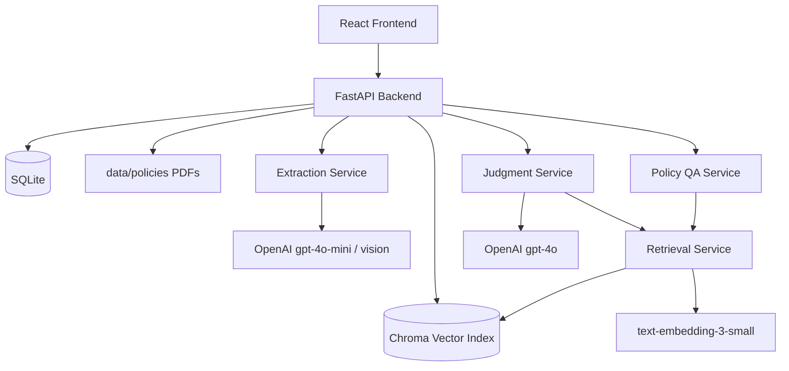

# Northwind Expense Pre-Review

AI-assisted expense pre-review system for Northwind Logistics. The system extracts receipt data,
retrieves relevant policy clauses, produces a pre-review verdict with citations and confidence, and
keeps a human reviewer in control through override and audit workflows.

## What this delivers

From a normal browser, a reviewer can:

1. Select a seeded employee or create a new one and start a submission with trip context.
2. Upload mixed-format receipts (`.pdf`, `.png/.jpg`, `.txt`) and process each as a line item.
3. See per-line verdicts (`compliant`, `flagged`, `rejected`) with reasoning, quoted policy clauses,
   and confidence.
4. Override any verdict with a reviewer comment and preserve audit history.
5. Browse submission history and inspect details.
6. Ask policy questions and get grounded answers or explicit refusal for out-of-scope/weak-evidence prompts.

## Architecture



## Why these design choices

### Retrieval and chunking

- Policy PDFs are chunked by section with metadata (`doc_id`, `section`, cross-references).
- Chroma is persisted on disk for local/dev simplicity and restart survival.
- Section-aware chunking improves citation grounding over naive page-level chunks and helps reduce
  policy-noise collisions.

### Model tiering

- Extraction uses `gpt-4o-mini` (cost-efficient, vision-capable for images/scanned PDFs).
- Judgment uses `gpt-4o` (better reasoning quality for policy interpretation and borderline cases).
- Embeddings use `text-embedding-3-small` for compact retrieval cost.

### When vision is used

- PDFs are text-extracted first with PyMuPDF.
- If PDF text layer is empty, extraction falls back to vision.
- Images (`.png/.jpg`) are processed with vision directly.

### Confidence and verdict routing

- Final confidence combines extraction quality, retrieval similarity, and model confidence.
- `flagged` is used when evidence is weak/ambiguous/low-similarity.
- `rejected` is reserved for stronger policy-supported violations.
- Low-confidence paths deliberately prefer human review over confident guessing.

### Citation faithfulness

- Citation quotes are verified against retrieved chunks.
- Non-grounded citations are removed; non-flagged outcomes without valid citation support are
  downgraded for human review.

### Refusal behavior

- Q&A refuses out-of-scope prompts.
- Q&A also refuses when retrieval evidence is weak, rather than fabricating.

## Repository layout

- `backend/` FastAPI backend, retrieval/extraction/judgment/QA services
- `frontend/` React + Vite + Tailwind reviewer UI
- `eval/` verification scripts + Part 8 evaluation harness
- `data/` local persistent state (`SQLite`, `Chroma`, uploads, sample data)
- `docs/` plan, brief, deployment and test guides

## Run locally (dev)

### 1) Prerequisites

- Python 3.11+
- Node 20+
- `uv`
- OpenAI API key

### 2) Setup env

```bash
cp .env.example .env
```

Set `OPENAI_API_KEY` in `.env`.

### 3) Backend

```bash
uv sync
uv run uvicorn backend.app.main:app --reload
```

Health check:

```bash
curl http://127.0.0.1:8000/api/health
```

### 4) Frontend

```bash
cd frontend
cp .env.example .env
npm install
npm run dev
```

By default frontend dev uses `VITE_API_BASE=http://127.0.0.1:8000`.

## Run with Docker

Build:

```bash
docker build -t northwind-pre-review:part9 .
```

Run:

```bash
docker run --rm -p 8000:8000 northwind-pre-review:part9
```

Then open `http://127.0.0.1:8000`.

## Deployment

- Render blueprint config: `render.yaml`
- Full runbook: `docs/DEPLOYMENT.md`

Recommended runtime env paths:

- `SQLITE_PATH=/app/runtime/northwind.db`
- `CHROMA_PATH=/app/runtime/chroma`
- `UPLOADS_DIR=/app/runtime/uploads`
- `POLICIES_DIR=/app/data/policies`

`OPENAI_API_KEY` must be set as a secret.

## Evaluation harness

Part 8 harness command:

```bash
uv run python eval/run.py --expected eval/expected.sample.json
```

Also provided:

- `eval/expected.stable.json` (broader benchmark subset)
- Part-wise verification scripts in `eval/verify_part*.py`

Metrics reported by harness:

- verdict accuracy
- retrieval quality (expected doc in top-k)
- citation correctness
- Q&A refusal accuracy
- out-of-scope refusal rate

Live deployment smoke check:

```bash
uv run python eval/verify_live_url.py --base-url https://your-app-url
```

## Rough cost model (per submission)

This is intentionally approximate and should be recalibrated with your account pricing and real
token telemetry.

Assumptions:

- 6 receipts per submission
- text-first extraction for most PDFs, vision fallback for some images/scans
- 1 judgment call per receipt
- optional 1 Q&A query

Practical estimate:

- Typical: low tens of cents per submission
- Heavier scanned/vision-heavy cases: can move toward ~1 USD per submission

Major drivers:

- number of LLM calls per receipt
- proportion of vision-based extraction
- retrieval top-k/context size
- rejudge/retry frequency

## Scaling approach to 10,000 submissions/day

Current MVP is single-instance friendly; to scale to 10k/day:

1. Move SQLite to managed Postgres.
2. Move Chroma to a service tier or migrate retrieval store to pgvector/managed vector DB.
3. Split ingestion/judgment into async workers + queue (keep API responsive).
4. Add request-level caching and idempotency keys around repeat processing.
5. Precompute and cache policy retrieval artifacts; keep index updates controlled.
6. Add observability (latency, token spend, refusal/flag rates, citation failure counters).
7. Introduce autoscaling and concurrency controls for LLM-bound workflows.

## Known limitations

- Current policy corpus in this repo is incomplete relative to the full brief corpus, which can
  make some judgments conservative (`flagged`) under weaker retrieval evidence.
- Some line-item verdicts can vary across runs due to LLM nondeterminism.

## What's next

- Complete live deployment and publish URL.
- Expand policy corpus ingestion and re-run evaluation.
- Improve determinism around borderline meal/alcohol cases.
- Add broader automated regression coverage for end-to-end browser flows.
